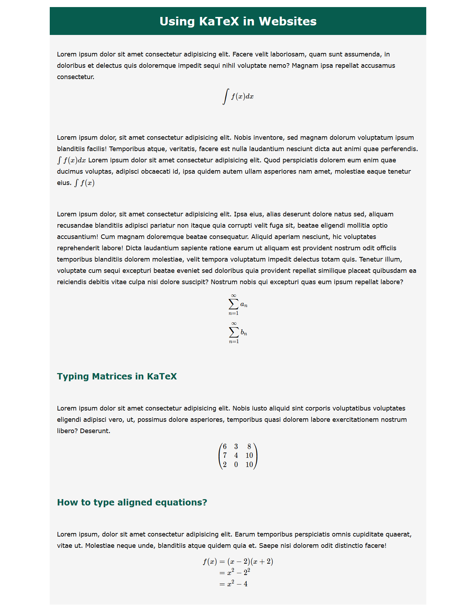

## KaTeX Integration in Websites 

A light weight javascript library which helps to beautify our websites when we use mathematical expressions. 

This repository contains the code snippet for the tutorials on KaTeX. 

The final finished product is the following. 

